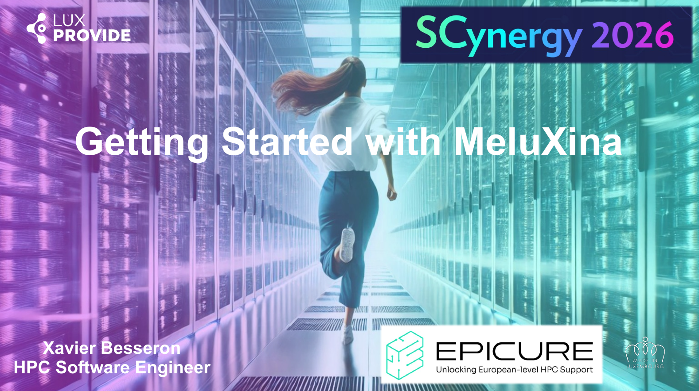

{ width="640" }

# Getting Started with MeluXina

This training is given in the context of the [Scynergy 2026 event](https://www.scynergy.events/). It offers to the participants a quick overview of the different ways to access and use [MeluXina supercomputer](https://docs.lxp.lu/system/overview/). 

It has been developed by the **Supercomputing Application Services** group at [**LuxProvide**](https://luxprovide.lu) in the context of the [**EPICURE project**](https://epicure-hpc.eu/).

{ width="420" }
{ width="320" }

## Objectives

- Gain a foundational understanding of **High-Performance Computing** (HPC).
- Learn how to securely access and navigate the **MeluXina supercomputer**:
    - Connecting using the SSH or the Web-portal;
    - Uploading and downloading files;
    - Running computing jobs.
- Explore **practical workflows**, including urban wind simulation and AI-driven analysis using PyTorch.

{ width="800" }

## Agenda

Today's training is composed of:

- A **presentation** (30 minutes)
    - HPC and HPC platforms
    - How to use an HPC system
    - The specifics of MeluXina supercomputer
- A **hands-on** session with three activities (50 minutes)
    - First connections to MeluXina
    - HPC workflow: Urban wind simulation and visualization
    - AI workflow: PyTorch notebook with JupyterLab on MeluXina


---

## 👨‍🏫 Part 1 - Presentation: Short introduction to HPC and MeluXina

👉 Click on the image to download the slides of the presentation.

[{ width="640" }](files/Getting_Started_with_MeluXina.pdf)

!!! abstract "Presentation outline"

    - High Performance Computing
        - What is HPC?
    - HPC Platforms
        - Hardware view
        - Software view
    - Using an HPC platform
        - User Interfaces
        - Interactive vs batch job
        - Job scheduler
        - Software environment
    - MeluXina in practice
        - User and project accounts
        - Data storage
        - Authentication
        - Terminal access
        - Web-portal access


-----------------------------------

## 🔑 Part 2 - Hands-on: Connections to MeluXina

We want to configure two different ways to access MeluXina:

- The **command line** access using the Secure Shell (SSH).
- The **web-portal** access with username and password.

### Command line access using SSH key

- SSH (Secure Shell) is the de-facto standard to access remote Linux machines and supercomputing platforms. 
- It is fast, lightweight, and secure, offering a command-line interface (CLI) with the Shell. The security relies on an SSH key pair (public/private keys).


#### Setup of SSH Access

Configuring your SSH access to MeluXina requires the following steps that have to be done once for all:

- [Generating an SSH key](https://docs.lxp.lu/first-steps/connecting/#generating-an-ssh-key-pair)
- [Uploading your public SSH key](https://docs.lxp.lu/first-steps/connecting/#upload-your-public-ssh-key)
- [Connecting to MeluXina](https://docs.lxp.lu/first-steps/connecting/#connect-to-meluXina)

!!! tip

    Working on Linux or MacOS is a great advantage for this as most of the tools are already available and follow the standard configuration.

    If you work on Windows, it is recommended to install [Windows Subsystem for Linux (WSL)](https://learn.microsoft.com/en-us/windows/wsl/about)
    and set up an [Ubuntu subsystem from the Microsoft Store](https://apps.microsoft.com/detail/9pdxgncfsczv?hl=en-US&gl=US).
    Thus, you can directly work on Linux within Windows.

??? info "Guidelines to Handle Your SSH Keys"

    Handling SSH Keys can be confusing and intimidating at first.
    It is about security and it should be taken seriously when all the devices are connected to the Internet. Here are a few guidelines:

    - The term "pair of SSH keys" refers to the **public and private keys** associated together.
    - The private key is meant to be **private**: Never share it with anyone! Don't send it by email! (not even to yourself) Don't put it on a Cloud drive (Dropbox, Google Drive, MS OneDrive, etc.).
    - Generate one pair of keys for each of your `account@machine`. Don't try to copy your keys around. It makes it easier to block an access if it gets compromised.
    - Protect your SSH key with a passphrase. Without that, if your laptop gets stolen, your accesses to remote machines get compromised too! Instead, learn to use SSH Agent so you need to type your passphrase only once after booting your laptop.
    - You're not allowed to share your HPC access with another person. If you need to do it for some reason (e.g. debugging issues specific to your account), you should NOT share your private SSH key. Instead, you should authorize the SSH public of the other person to access your account (via IPA or `.ssh/authorized_keys`)

#### Connection to HPC Access

When using a supercomputer, you will usually first connect to a login or **access node**.
From this machine, you can check your files, disk quota, and computing usage.
It is intended to be used by the user to prepare computing jobs and scripts and then submit them to the job scheduler.

Because the access node is shared by all the users of the platform,
it should not be used to compile and install your software and it should definitely not be used to run any memory or computing-intensive task.

This is an excerpt of the [Acceptable Use Policy of MeluXina](https://docs.lxp.lu/policies/aup/) that you accepted to get an account on the platform:

> The login (access) nodes of the MeluXina cluster are reserved for data transfer
> to/from the clusters, preparation of job submissions to the queueing system and
> checking the status of computational jobs. The login nodes must not be used for
> compute or I/O bound processes. Processes inappropriate to execute on the login
> nodes may be killed and the user notified.

Usually, there are some guardrails implemented on the access node to prevent unwanted usage. For example, there is no compiler installed or the `module` command is not available.

To connect to MeluXina, you will use the SSH command with your credentials:

```bash
ssh '<your-user-ID>'@login.lxp.lu -p 8822 -i ~/.ssh/id_ed25519_mlux
```

If you have configured your SSH config file with an alias (recommended), you can simply connect with:

```bash
ssh meluxina
```

!!! info

    In the example above, `meluxina` does not name a specific machine.
    Instead, it refers to an entry in the SSH config file that defines a set of configuration items, like the **hostname** (actual address on the internet),
    the **port** of the SSH service and your **username**, so you don't need to remember them and enter them every time.


If the connection is successful, you should see the MeluXina welcome banner:

<pre style="font-size: 0.8rem; background: #f5f5f5; padding: 1rem; border-radius: 4px;">
        Welcome to the Luxembourg - EuroHPC supercomputer

         ████     ████          ██         ██     ██ ██
        ░██░██   ██░██         ░██        ░░██   ██ ░░
        ░██░░██ ██ ░██  █████  ░██ ██   ██ ░░██ ██   ██ ███████   ██████
        ░██ ░░███  ░██ ██░░░██ ░██░██  ░██  ░░███   ░██░░██░░░██ ░░░░░░██
        ░██  ░░█   ░██░███████ ░██░██  ░██   ██░██  ░██ ░██  ░██  ███████
        ░██   ░    ░██░██░░░░  ░██░██  ░██  ██ ░░██ ░██ ░██  ░██ ██░░░░██
        ░██        ░██░░██████ ███░░██████ ██   ░░██░██ ███  ░██░░████████
        ░░         ░░  ░░░░░░ ░░░  ░░░░░░ ░░     ░░ ░░ ░░░   ░░  ░░░░░░░░

    .-----------------------------------------------------------------------------.
    | You are on a MeluXina login node                                            |
    |-----------------------------------------------------------------------------|
    |                       System information: Compute                           |
    |-----------------------------------------------------------------------------|
    | Nodes | CPU                     | RAM    | Accelerator              | Disk  |
    |-------|-------------------------|--------|--------------------------|-------|
    | 573N  | 2x AMD 7H12: 128c @2.6G |  512GB | -                        | -     |
    | 200N  | 2x AMD 7452:  64c @2.3G |  512GB | 4x NVIDIA A100-40        | 1.92T |
    |  20N  | 2x AMD 7452:  64c @2.3G |  512GB | 2x Intel Stratix 10MX-16 | 1.92T |
    |  20N  | 2x AMD 7H12: 128c @2.6G | 4096GB | -                        | 1.92T |
    |-----------------------------------------------------------------------------|
    |                       System information: Data                              |
    |-----------------------------------------------------------------------------|
    | Tier           | Capacity | Speed   | Type | Location on compute/login      |
    |----------------|----------|---------|------|--------------------------------|
    | Scratch        | 0.6PB    | 400GB/s | NVMe | /project/scratch               |
    | Home/Project   | 12.5PB   | 180GB/s | HDD  | /home/users, /project/home     |
    | Backup         | 7.5PB    | 30GB/s  | HDD  | -                              |
    |-----------------------------------------------------------------------------|
    |                       System information: Interconnect                      |
    |-----------------------------------------------------------------------------|
    | Fabric: Infiniband HDR, 200Gbps, DragonFly+ topology                        |
    | Links : 1x on CPU nodes, 2x on GPU, FPGA & LargeMemory nodes                |
    |-----------------------------------------------------------------------------|
    |                       System information: Software                          |
    |-----------------------------------------------------------------------------|
    | Production software stack: 2024.1                                           |
    |                                                                             |
    | Modules system: LMod, use `module av` on nodes to discover the environment  |
    |-----------------------------------------------------------------------------|
    |                           Center information                                |
    |-----------------------------------------------------------------------------|
    | News & Events      : luxprovide.lu                                          |
    | Documentation      : docs.lxp.lu                                            |
    | System status      : status.lxp.lu                                          |
    | Support            : servicedesk.lxp.lu, servicedesk@lxp.lu                 |
    |-----------------------------------------------------------------------------|
    | LinkedIn & Twitter : @luxprovide #meluxina @EuroHPC_JU                      |
    °_____________________________________________________________________________°
</pre>

The shell prompt (last line on the terminal) should indicate that you're correctly connected to the MeluXina login node.


??? failure "Failing to connect?"

    If you fail to connect, don't panic! Instead look for clues that would indicate the reason of the failure:

    1. Any error message? Check carefully all the output lines on your terminal, and try to address the first one.
    2. Need more information from SSH? Add the `-v` option (like verbose) after the `ssh` command. That will give you more details about the connect process. You can add more `v` to get more detailed messages.
    3. Call me ! 👨‍🏫 This time I will help you getting this right, next time you're on your own 🙂


You made it! You're connected to the MeluXina supercomputer.


### Web-portal access using username and password

The Open OnDemand web portal provides a graphical interface to access MeluXina services.

!!! info "Status"

    The Open OnDemand service is currently **in development**. It will be available soon.

When available, you will be able to connect by:

1. Entering your **user ID** (u10XXXX) and **password** (set during onboarding)
2. If you have enabled **2FA**, you'll be prompted for a one-time code
3. Upon successful login, you'll land on the Open OnDemand Welcome page with access to:
    - **Shell Access**: Terminal interface
    - **Home Directory**: Browse and manage files
    - **Active Jobs**: Monitor your jobs
    - **Desktop**: Virtual machine access
    - **Graphical applications**: Run GUI applications directly from the portal

For more information, see the [Open OnDemand documentation](https://docs.lxp.lu/web_services/open_ondemand/howtoconnect/).
---

## 🏙️ Part 3 - Hands-on: Urban wind simulation and visualization

To be completed later

---

## 🧠 Part 4 - Hands-on: PyTorch notebook with JupyterLab

To be completed later
